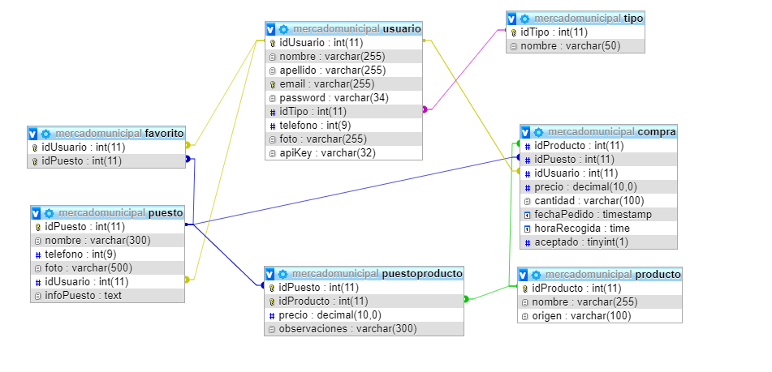

# Mercado-Municipal
Proyecto para Desarrollo Web en Entorno Servidor
# Introducción
Mi proyecto es una aplicación web para un mercado municipal, en el cual te podrás registrar, visualizar los puestos del mercado y el usuario registrado también tendrá control sobre sus datos personales y modificarlos si quisiera, o darse de baja en cualquier momento.
Se podrá obtener información a cerca de los puestos que se encuentren registrados en el mercado, y añadirlos a una lista de favoritos
para tener los que más te gustan. 
Para una proxima ampliación, me gustaría que los usuarios puedan añadir sus propios comentarios a cerca de lo que les parece ese puesto en particular y darle una puntuación, también se podrán hacer pedidos para recoger en el puesto y contará con la división de la página por tipo de usuario. 
**Por Cintia García Ruiz**  
**2º Desarrollo de Aplicaciones Web**

## Página Index
En esta página se puede elegir entre iniciar sesión o registrarse, internamente está oculto el cuadro para iniciar sesión y solo si pulsas iniciar sesión aparece para loguearse:

 
 

## Página Registro
Aquí se puede registrar como nuevo usuario cuando entras de nuevas; Si no ponemos una imagen de usuario por defecto se añade una foto de un avatar para que no quede vacia, desde la base de datos se comprueba que el email es unico(añadiendo el campo como clave unica) para que no haya dos iguales registrados ya que la clave primaria es autoincremental y podrían haber insertado dos email iguales:

 
 

## Página Inicio
Desde este apartado se pueden visualizar todos los puestos que hay registrados en la base de datos, seleccionar uno en concreto para ver su información o navegar por el menú del navbar, está puesto en ajax que primero se visualicen los primeros 8 puestos y según bajes el scroll aparezcan los demás puestos:

 

## Página Información
En esta página se visualiza la información de un puesto en concreto que se haya seleccionado; la foto del mismo, nombre,teléfono de contacto e información acerca de él. También tenemos dos botones con los que se puede añadir a nuestra página de favoritos o quitar:

 
 

*Favoritos
 

## Página Perfil
Aquí se visualizan los datos del usuario, y hay dos funciones a realizar, modificación de los datos y baja de usuario. 
En el caso de que el usuario se quiera dar de baja aparece una ventana modal para poder confirmar que se quiere dar de baja.
Si se pulsa guardar cambios, hay datos nuevos y no hay problemas en la modificación de los datos aparece un mensaje diciendo que se ha hecho correctamente,o en el caso de que no haya cambios o no se ejecute bien aparece un mensaje de alerta: 

 
 
 
 

## Base de datos
Modelo Entidad-Relación de mi proyecto , más las tablas y relaciones en la base de datos, en esta segunda se muestran todas las tablas que son necesarias para el proyecto final:

 
 

